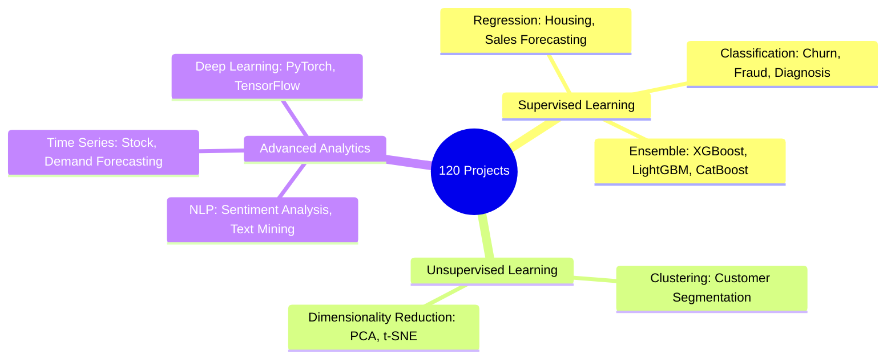

# 📚 Data Science Portfolio: 120+ Practical Implementations

Udemy Data Science Marathonを通じて構築した、**120以上の具体的な課題解決シナリオ**を体系化した実装アーカイブです。
特定のライブラリや手法に固執せず、データの性質とビジネス要求に合わせて「最適なアルゴリズムを即座に選択・実装できる引き出し」の証明として公開しています。

---

## 📈 ADR: Architectural Decision Records (意思決定の根拠)

> **「なぜ120もの多種多様なプロジェクトを網羅したのか」**
> 実務の現場では、単一のモデルですべての課題を解決することは不可能です。
> 古典的な統計手法から最新のディープラーニング、NLPまでを横断的に実装することで、**「精度、解釈性、計算コスト」のトレードオフを理解し、ビジネスのROIを最大化する手法を最短距離で提案できる状態**を作るためです。

---

## 📊 ポートフォリオの構成 (Knowledge Map)

---

## 🛠️ エンジニアリング・ハイライト

### 1. 探索的データ分析 (EDA) の定型化
- **Action**: 全プロジェクトで欠損値処理、外れ値検知、相関分析を標準化。
- **Why**: データの「筋」を正しく捉えることで、モデル構築前の段階で結果の8割が決まるという実務の重要性を形式知化しています。

### 2. アルゴリズムの適材適所 (Right Tool for the Right Job)
- **Action**: 単純な回帰から、勾配ブースティング、ニューラルネットワークまでを比較実装。
- **Why**: 解釈性が求められるコンサルティング案件（アクセンチュア的）と、純粋な精度が求められるエンジニアリング案件（Amazon的）の両方に対応できる柔軟性を担保しています。

---

## 📂 カテゴリ別インデックス (Directory Index)

- `Regression/`: 数値予測、価格最適化
- `Classification/`: 顧客離反、異常検知、カテゴリ分類
- `NLP/`: 感情分析、テキスト分類
- `Time-Series/`: 需要予測、在庫最適化

---

## 🎖️ About Me

**Kou Sato (Moheji)**
* **Mission**: 「技術をビジネスの価値（ROI）に翻訳する」
* **Goal**: 2026年11月、DE/DS転身。120の「引き出し」から、現場の課題に最適な解をデリバリーします。

© 2026 kou-sato-ds