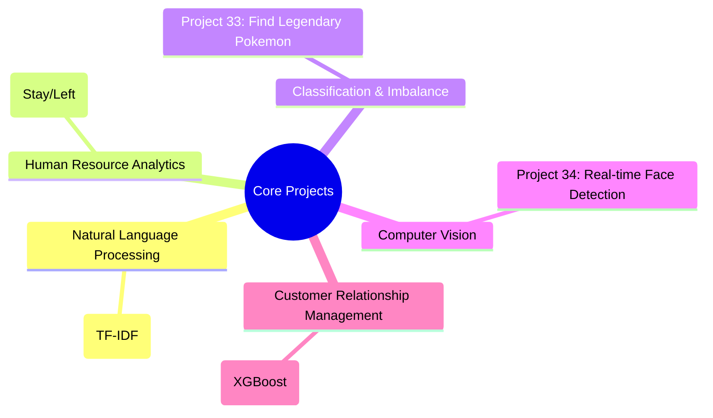

# 📚 Data Science Portfolio: Targeted Business Solutions

本リポジトリは、Udemy Data Science Marathonを通じて習得した120以上の手法の中から、**実務への即応性が高い5つのコア・プロジェクト**を厳選して体系化した実装アーカイブです。
「どの手法を使うか」ではなく、「どの課題をどう解決するか」というビジネスROIの視点で構成しています。

---

## 📊 ポートフォリオの構成 (Solution Map)

---

## 🌟 厳選ケーススタディ (Featured Case Studies)

画像エビデンスに基づいた、各プロジェクトのビジネス的意義です。

### 1. 【NLP】キーワード抽出によるインサイト自動化 (Project 24)
- **概要**: TF-IDFを用い、大量のテキストからドメイン特有の重要語句を抽出。
- **実務価値**: カスタマーサクセスにおけるVoC分析の自動化など、非構造化データからの迅速な意思決定を支援。

### 2. 【HRテック】組織改善のための離職要因分析 (Project 32)
- **概要**: 従業員属性データから離職（Stay/Left）を予測。
- **実務価値**: Stratified K-foldによる汎化性能の担保により、特定の部署や属性における離職リスクを定量化。

### 3. 【不均衡データ】稀少イベントの検知最適化 (Project 33)
- **概要**: 「伝説のポケモン」という極端に少ないサンプルを特定。
- **実務価値**: 不正検知や機器故障予測など、サンプルが極端に少ない「稀少事象」への対処技術を実証。

### 4. 【画像解析】エッジAIへの応用可能性 (Project 34)
- **概要**: OpenCVを用いたリアルタイム顔検知（黄金の6ステップ）。
- **実務価値**: 実店舗での来店客属性分析など、リアルタイム動画像処理のパイプライン構築能力を証明。

### 5. 【CRM】顧客離反予測によるLTV最大化 (Project 59)
- **概要**: XGBoostを用いた高精度な銀行顧客の離反予測。
- **実務価値**: 離反予備軍を事前に特定することで、マーケティングコストを最適化し、既存顧客の維持率を向上。

---

## 🎖️ About Me

**Kou Sato (Moheji)**
* **Mission**: 「技術をビジネスの価値（ROI）に翻訳する」
* **Goal**: 2026年11月、DE/DS転身。5つの「即戦力武器」を携え、現場の課題を解決します。

© 2026 kou-sato-ds