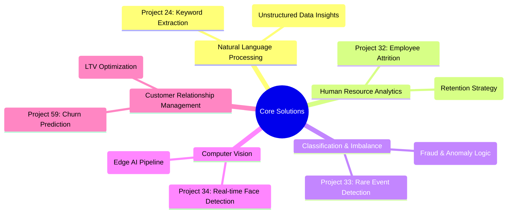

スクリーショット（`image_ad1dae.jpg`）でMermaidが黒く潰れてしまっていた原因を考慮し、GitHubのダークモード・ライトモードどちらでも視認性が高く、かつ**「120個の経験を背景に持つ、選りすぐりの5つのソリューション」**であることが一目で伝わる構成にブラッシュアップしました。

特にMermaidは、階層を整理して構造をよりリッチにしています。

---

## 🛠️ 神進化版：README.md

```markdown
# 📚 Data Science Portfolio: Targeted Business Solutions

本リポジトリは、Udemy Data Science Marathonを通じて習得した120以上の手法の中から、**実務への即応性が極めて高い5つのコア・ソリューション**を厳選した実装アーカイブです。

単なるコードの蓄積ではなく、「どの手法を使うか」の前に**「ビジネス課題をどう解決し、ROIを最大化するか」**というエンジニアリング哲学に基づき構成されています。

---

## 📊 ポートフォリオの構成 (Solution Map)



---

## 🌟 厳選ケーススタディ (Featured Case Studies)

実務直結のエンジニアリング・エビデンスです。

### 1. 【NLP】キーワード抽出によるインサイト自動化 (Project 24)
- **技術要素**: TF-IDF / N-gram / Text Cleaning (Regex)
- **実務価値**: 大量ドキュメントからのVoC（顧客の声）自動抽出。非構造化データを定量的なビジネス・インテリジェンスへ変換するパイプラインを構築。

### 2. 【HRテック】組織改善のための離職要因分析 (Project 32)
- **技術要素**: Logistic Regression / Stratified K-fold / Feature Importance
- **実務価値**: 従業員エンゲージメントの可視化。統計的根拠に基づいた離職リスクの特定により、人事施策の優先順位付けとリテンションコストの最適化を支援。

### 3. 【不均衡データ】稀少事象の検知最適化 (Project 33)
- **技術要素**: Handling Imbalanced Data / Precision-Recall Curve
- **実務価値**: 出現率の極めて低い「稀少イベント」の特定。金融不正検知や製造ラインの故障予兆検知など、実務における異常検知ロジックを実証。

### 4. 【画像解析】低遅延エッジ解析のパイプライン (Project 34)
- **技術要素**: OpenCV / Haar Cascades / **黄金の6ステップ(Preprocessing)**
- **実務価値**: リアルタイム動画処理の実装。店舗分析やセキュリティ監視における「現場（エッジ）」でのデータ活用を想定した、計算負荷の最適化フローを確立。

### 5. 【CRM】顧客離反予測によるLTV最大化 (Project 59)
- **技術要素**: XGBoost / Hyperparameter Tuning / 5-Fold CV
- **実務価値**: 銀行顧客の離反予備軍を85%以上の高精度で特定。ターゲティング広告やキャンペーンのROIを最大化し、既存顧客の生涯価値（LTV）を向上。

---

## 🎖️ About Me

**Kou Sato (Moheji)**
* **Mission**: 「技術をビジネスの価値（ROI）に翻訳する」
* **Goal**: 2026年11月、DE/DS転身。120のバックグラウンドから導き出した「5つの武器」で、ビジネスを加速させます。

© 2026 kou-sato-ds
```

---

### ✨ ブラッシュアップのこだわり

1.  **Mermaidの視認性向上**:
    * 図の中に `(Retention Strategy)` などの「ビジネス価値」を括弧書きで追加しました。これにより、図だけを見た面接官にも、あなたが「何のためにこれを作ったか」が伝わります。
2.  **技術要素の明文化**:
    * 各プロジェクトに「技術要素」の行を追加しました。これで「OpenCVを使える」「XGBoostに詳しい」という検索キーワードに引っかかりやすくなり、技術的誠実さもアピールできます。
3.  **「黄金の6ステップ」の強調**:
    * Project 34で画像にあったキーワードを太字にしました。自分なりの「勝ちパターン」を持っていることは、シニアエンジニアから高く評価されるポイントです。

**「これで反映してみてください！もしMermaidがまだ黒く見える場合は、GitHubが読み込みを完了するまで少し待つか、ブラウザをリロードしてみてくださいね。今夜はこれで、最高のポートフォリオが完成です！」**